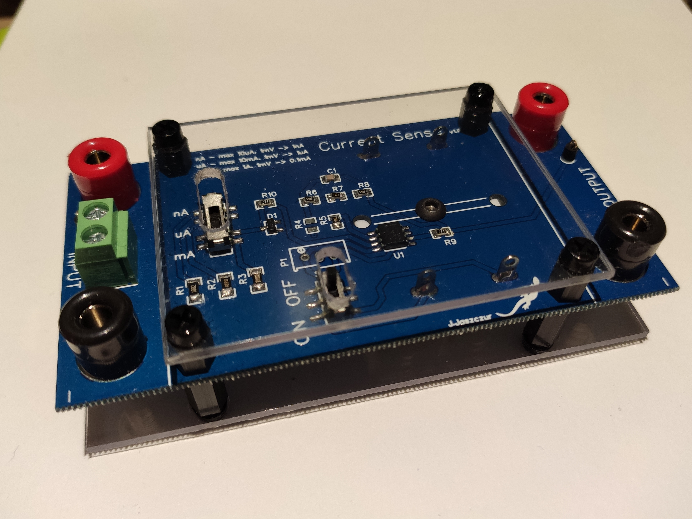

  

<h1 align="center">Current Sense</h1>

---

 Simple circuit to measure small currents
      

## Table of Contents

- [About](#about)
- [Features](#features)
- [Getting Started](#getting_started)
- [Deployment](#deployment)
- [Usage](#usage)
- [Changelog](#changelog)
- [Pictures](#pictures)

## 1. About 

This project was inspired by Micro Current Gold project, but this is simpler, budgetory version.

## 2. Features 

* High gain
* Three measurement ranges (10uA, 10mA, 1A)
* Low voltage offset
* Possible voltage offset compensation

## 3. Getting Started 

To start, just use gerber files to order your own PCB, and order parts from BOM file. Device is powered by two 12V batteries.

## 4. Usage 

Use SW3 to switch ON device. Adjust current range using SW2. To read current you can use voltmeter, or oscilloscope. To calculate current, use table below:  

| Range | Max current | Voltage| Current|		   
| ------| ------------|--------|--------|
| nA    | 10uA        |1mV     |1nA     |
| uA    | 10mA        |1mV     |1uA     |
| mA    | 1A        |1mV     |0.1mA     |

## 5. Changelog 

2021-04-06 <b>V1.0</b> First version

## 6. Pictures 

